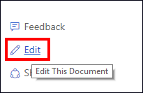

# Set up Git repository locally for documentation

This article describes the steps to set up a git repository on your local machine, with the intent to contribute to Microsoft documentation. Contributors may use a locally cloned repository to add new articles, do major edits on existing articles, or change artwork.

You run these one-time setup activities to get started contributing:
> [!div class="checklist"]
> * Determine the appropriate repository
> * Fork the repository to your GitHub account
> * Choose a local folder for the cloned files
> * Clone the repository to your local machine
> * Configure the upstream remote value

> [!IMPORTANT]
> If you're making only minor changes to an article, you *do not* need to complete the steps in this article. You can continue directly to the [minor/infrequent changes workflow](light-workflow.md).
>

## Overview

To contribute to Microsoft's documentation site, you can make and edit markdown files locally by cloning the corresponding documentation repository. Microsoft requires you to fork the appropriate repository into your own github account, so that you have read/write permissions there to store your proposed changes. Then you use pull requests to merge changes into the read-only central shared repository.

If you're new to GitHub, watch the following video for a conceptual overview of the forking and cloning process:

>[!VIDEO https://channel9.msdn.com/Blogs/CoolMoose/Git-Repository-Setup/player]

## Determine the repository

Documentation hosted at [docs.microsoft.com](https://docs.microsoft.com) resides in several different repositories at [github.com](https://www.github.com).

1. If you are unsure of which repository to use, then visit the article on docs.microsoft.com using your web browser. Select the **Edit** link (pencil icon) on the upper right of the article.

   

2. That link takes you to github.com location for the corresponding markdown file in the appropriate repository. Note the URL to view the repository name.

   

   For example, these popular repositories are available for public contributions:
   - Azure documentation [https://github.com/MicrosoftDocs/azure-docs](https://github.com/MicrosoftDocs/azure-docs)
   - SQL Server documentation [https://github.com/MicrosoftDocs/sql-docs](https://github.com/MicrosoftDocs/sql-docs)
   - Visual Studio documentation [https://github.com/MicrosoftDocs/visualstudio-docs](https://github.com/MicrosoftDocs/visualstudio-docs)
   - .NET Documentation [https://github.com/dotnet/docs](https://github.com/dotnet/docs)
   - Azure .Net SDK documentation [https://github.com/azure/azure-docs-sdk-dotnet](https://github.com/azure/azure-docs-sdk-dotnet)

## Fork the repository

GitHub has published a guide that walks you through the process of [forking a repo, cloning your fork, and submitting changes](https://guides.github.com/activities/forking/). This provides a good overview using many of the popular Git clients.
